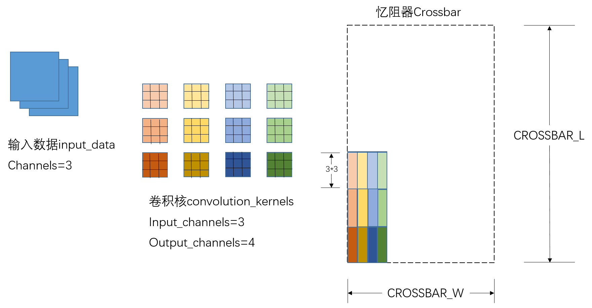

# 面向Crossbar的SystemC模拟器
本项目是面向Crossbar器件的模拟器，支持Visual Studio和cmake编译，可运行在Windows和Linux(Mac)下。


### 内容列表
- <a href='#安装'>安装</a>
- <a href='#数据集'>数据集</a>
- <a href='#运行'>运行</a>
- <a href='#性能'>性能</a>
- <a href='#样例'>样例</a>
- <a href='#下一步工作'>下一步工作</a>

&nbsp;
&nbsp;

## 安装
- 安装[SystemC库](http://www.accellera.org/downloads/standards/systemc)
	* 对于Windows用户，将systemc代码下载到本地之后，解压缩代码包。进入systemc文件夹，如`E:\systemc-2.3.2\msvc10\SystemC`中，用VS打开`SystemC.vcxproj`。对打开的项目分别用Debug模式和Release模式编译。
	* 对于Linux/Mac用户，将代码下载到本地之后，解压缩代码包。进入systemc文件夹，如`~/systemc-2.3.2`中，执行如下语句: 
	```Shell
	# 创建build文件夹
	mkdir build
	cd build
	# 使用cmake对systemc编译
	cmake ..
	make
	```
- (可选)安装[Cuda库](https://developer.nvidia.com/cuda-downloads)
	* 可参照cuda官网的的安装教程进行安装。
- 配置工程文件
	* 对于Windows用户，使用Visual Studio进行开发，可根据本项目中提供的Visual Studio的配置文件进行配置。注意，如下配置须自行修改：<br>
	(Debug和Release模式) 项目属性→C/C++→常规→附加包含目录→(SystemC库代码所在目录，如`E:\systemc-2.3.2\src`)<br>
	(Debug模式) 项目属性→链接器→常规→附加库目录→(Debug库所在目录，如`E:\systemc-2.3.2\msvc10\SystemC\Debug`)<br>
	(Release模式) 项目属性→链接器→常规→附加库目录→(Release库所在目录，如`E:\systemc-2.3.2\msvc10\SystemC\Release`)<br>
	* 对于Linux/Mac用户，使用Cmake进行代码编译。本项目已提供CMakeLists.txt文件，可根据需要自行修改链接库的路径。编译代码时需执行如下语句：
	```Shell
	# 创建build文件夹
	mkdir build
	cd build
	# 使用cmake对systemc编译
	cmake -DCMAKE_BUILD_TYPE=Release ..
	make
	# 将可执行文件拷贝到外层文件夹并执行
	cp simulator-windows ../
	./simulator-windows
	```

&nbsp;

## 数据集
- 本项目所用测试数据为cifar-10数据集的测试部分，总计10000张图片，已经将输入数据转换为3\*1024(32\*32)，并且放入`input`文件夹下。
- 测试集标签为`labels.csv`文件，放在项目源代码目录下。

&nbsp;


## 运行
- 参数配置
	* 电路相关参数(`config.h`)

	| DA参考电压 | AD参考电压 | DA宽度 | AD宽度 | Crossbar长度 | Crossbar宽度 | 每个Tile中Crossbar个数 |
	|:-:|:-:|:-:|:-:|:-:|:-:|:-:|
	| DA_V | AD_V | DA_WIDTH | AD_WIDTH | CROSSBAR_L | CROSSBAR_W | CROSSBAR_N |

	* 网络模型相关参数(`config.h`)

	| 卷积核大小 | 输入数据大小 | 图像通道数 | 图像尺寸 | 输入图片数目 | 池化大小 |
	|:-:|:-:|:-:|:-:|:-:|:-:|
	| KERNEL_SIZE | INPUT_SIZE(KERNEL_SIZE\*KERNEL_SIZE) | CHANNELS_3/32/48/80/128 | IMAGE_SIZE_32/16/8 | PICTURE_NUM | POOLING_SIZE_1/2/8 |

- 网络结构代码生成
	* 本项目使用Python代码`cpp_gen.py`，根据预先写好的模块模板来生成代码。各模块的模板文件为如下：

	| `conv_cpp.template` | `conv_buffer_cpp.template` | `linear_cpp.template` | `linear_buffer_cpp.template`|
	|:-:|:-:|:-:|:-:|
	| 卷积层模块模板 | 卷积层间Buffer模块模板 | 全连接层模块模板 | 全连接层间Buffer模块模板 |

	在`cpp_gen.py`文件中，存放了所需网络的结构列表，可通过修改该文件来生成不同的网络结构。

	* 代码生成时，须在命令行中执行如下语句（使用CPU或者GPU计算，二选一）：

	```Shell
	# 使用CPU进行计算
	python cpp_gen.py
	# 或者使用GPU进行计算
	python cpp_gen.py --cuda true
	```
	可以生成所需的网络结构头文件`stage_conv_*.h`, `conv_buffer_*.h`, `stage_linear_*.h`, `linear_buffer_*.h`. <br>
	在`main.cpp`文件中包含以上生成的头文件，并且根据各层之间的连接关系，在`main.cpp`文件中通过`sc_signal`进行串联。

&nbsp;


## 性能
- 准确率
	* 不包括AD/DA模块：NA
	* 包括AD/DA模块：NA
	* 加入噪音：NA
- 计算速度
	* 使用CPU计算：NA
	* 使用GPU计算：NA


&nbsp;


## 样例
- 使用VGG-16网络对CIFAR-10数据进行分类
	* 本项目默认生成了一个VGG-16网络，包括15个卷积层和2个全连接层，并且所有的权重（高维卷积核）全部转换为`CROSSBAR_L*CROSSBAR_W`的二维矩阵用于ReRam Crossbar计算。
	* 所有权重矩阵已经预先转换完成，并且存放在`weights`文件夹中。权重矩阵的转换方式如下图所示：
	

&nbsp;
&nbsp;


## 下一步工作
- 对AD/DA部分进一步完善
- 支持模块复用
- 每个Tile中多个Crossbar的完善
- 对CPU和GPU的计算部分进一步完善